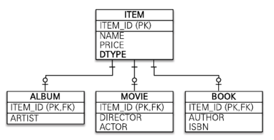
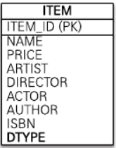
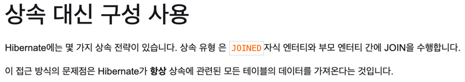
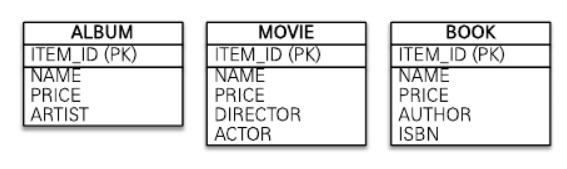

# 고급매핑

## 상속관계 매핑
- 각각의 테이블로 변환
- 통합 테이블로 변환
- 서브타입 테이블로 변환

### 1. 각각의 테이블로 변환 (조인전략)

- 엔티티 모두 테이블로 구성
- 자식 테이블이 부모 테이블의 기본 키를 받아서 기본키 + 외래키로 사용하는 전략
- JoinXXX 엔티티로 실습

#### 장점
1. 테이블이 정규화된다.
2. 외래키 참조 무결성 제약조건을 활용할 수 있다.
3. 저장공간을 효율적으로 사용한다.

#### 단점
1. 조회할 때 조인이 많이 사용되므로 성능이 저하될 수 있다.
2. 조회 쿼리가 복잡하다.
3. 데이터를 등록할 INSERT SQL을 두번 실행한다.습

### 2. 통합 테이블로 변환 (단일 테이블 전략)

- 테이블을 하나만 사용하고 구분 컬럼으로 어떤 자식 데이터가 저장되었는지 구분
- 조회할때 조인을 사용하지 않음
- IntegratedXXX 엔티티로 실습 

#### 장점
1. 조인이 필요 없으므로 일반적으로 조회 성능이 빠르다.
2. 조회 쿼리가 단순하다.

#### 단점
1. 자식 엔티티가 매핑한 컬럼은 모두 null을 허용해야 한다.
2. 단일 테이블에 모든 것을 저장하므로 테이블이 커질 수 있다.
3. 그러므로 상호아에 따라서는 조회 성능이 오히려 느려질 수 있다.

### 3. 서브타입 테이블로 변환 (구현 클래스마다 테이블 전략)

- 자식 엔티티마다 테이블을 생성
- 각 엔티티마다 필요한 컬럼을 모두 작성
- SubXXX 엔티티로 실습

#### 장점
1. 서브 타입을 구분해서 처리할 때 효과적이다.
2. not null 제약조건을 사용할 수 있다.

#### 단점
1. 여러 자식 테이블을 함께 조회할 때 성능이 느리다. (SQL UNION 사용)
2. 자식 테이블을 통합해서 쿼리하기 어렵다.

### 클래스별 테이블 전략을 추천하지 않는 이유?
- 데이터 공간을 많이 차지
- 단순 조회쿼리에 UNION 사용
- 객체 지향적이지도 않고, RDB 정규적이지도 않음

### 조인전략 vs 단일 테이블 전략
- 언제 어떤 전략을 써야할까?
- (개인적인 견해)
    - 두가지 경우 모두 상황에 맞춰 써야겠지만, 기본적으로는 조인전략이 좀 더 나을것 같다.
    - RDB를 사용하는 근본적인 이유부터 생각해 볼 필요가 있다.
    - 단일 테이블 전략은 NoSQL 데이터 베이스에 좀 더 잘 어울릴것 같다.

### 결론 (개인적인 견해)
- @Inheritance 이거 꼭 써야하는가?
- 제일 괜찮은 방식인 조인전략도 기본 EAGER 조회에 LAZY 방식으로 변경하는 방법이 없다. (일단 나는 못찾았다.)
- 상속매핑 자체가 부모테이블 - 자식테이블이 1:1의 관계라면 @OneToOne을 사용하면 안될까?
- FetchType도 제공해주고 좀더 다양한 설정값을 활용한다면 편하지 않을까? 
