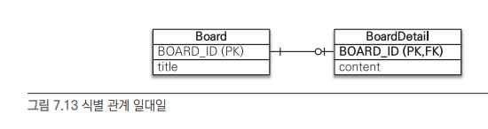

# 고급매핑

## 상속관계 매핑
- 각각의 테이블로 변환
- 통합 테이블로 변환
- 서브타입 테이블로 변환

### 1. 각각의 테이블로 변환 (조인전략)

- 엔티티 모두 테이블로 구성
- 자식 테이블이 부모 테이블의 기본 키를 받아서 기본키 + 외래키로 사용하는 전략
- JoinXXX 엔티티로 실습

#### 장점
1. 테이블이 정규화된다.
2. 외래키 참조 무결성 제약조건을 활용할 수 있다.
3. 저장공간을 효율적으로 사용한다.

#### 단점
1. 조회할 때 조인이 많이 사용되므로 성능이 저하될 수 있다.
2. 조회 쿼리가 복잡하다.
3. 데이터를 등록할 INSERT SQL을 두번 실행한다.

### 2. 통합 테이블로 변환 (단일 테이블 전략)

- 테이블을 하나만 사용하고 구분 컬럼으로 어떤 자식 데이터가 저장되었는지 구분
- 조회할때 조인을 사용하지 않음
- IntegratedXXX 엔티티로 실습 

#### 장점
1. 조인이 필요 없으므로 일반적으로 조회 성능이 빠르다.
2. 조회 쿼리가 단순하다.

#### 단점
1. 자식 엔티티가 매핑한 컬럼은 모두 null을 허용해야 한다.
2. 단일 테이블에 모든 것을 저장하므로 테이블이 커질 수 있다.
3. 그러므로 상황에 따라서는 조회 성능이 오히려 느려질 수 있다.

### 3. 서브타입 테이블로 변환 (구현 클래스마다 테이블 전략)

- 자식 엔티티마다 테이블을 생성
- 각 엔티티마다 필요한 컬럼을 모두 작성
- SubXXX 엔티티로 실습

#### 장점
1. 서브 타입을 구분해서 처리할 때 효과적이다.
2. not null 제약조건을 사용할 수 있다.

#### 단점
1. 여러 자식 테이블을 함께 조회할 때 성능이 느리다. (SQL UNION 사용)
2. 자식 테이블을 통합해서 쿼리하기 어렵다.

### 클래스별 테이블 전략을 추천하지 않는 이유?
- 데이터 공간을 많이 차지
- 단순 조회쿼리에 UNION 사용
- 객체 지향적이지도 않고, RDB 정규적이지도 않음

### 조인전략 vs 단일 테이블 전략
- 언제 어떤 전략을 써야할까?
- (개인적인 견해)
    - 두가지 경우 모두 상황에 맞춰 써야겠지만, 기본적으로는 조인전략이 좀 더 나을것 같다.
    - RDB를 사용하는 근본적인 이유부터 생각해 볼 필요가 있다.
    - 단일 테이블 전략은 NoSQL 데이터 베이스에 좀 더 잘 어울릴것 같다.

### 결론 (개인적인 견해)
- @Inheritance 이거 꼭 써야하는가?
- 제일 괜찮은 방식인 조인전략도 기본 EAGER 조회에 LAZY 방식으로 변경하는 방법이 없다. (일단 나는 못찾았다.)
- 상속매핑 자체가 부모테이블 - 자식테이블이 1:1의 관계라면 @OneToOne을 사용하면 안될까?
- FetchType도 제공해주고 좀더 다양한 설정값을 활용한다면 편하지 않을까? 

---

## @MappedSuperClass

- 부모 클래스는 테이블과 매핑하지 않고 부모 클래스를 상속받는 자식 클래스에게 매핑정보만 제공

### 특징
1. 테이블과 매핑되는것이 아니다. 그저 매핑정보를 상속하기 위한 용도
2. 엔티티가 아니기 때문에 em.find(), JPQL에서 사용 불가
3. 추상클래스를 권장

### 보통 생성자, 생성일, 수정자, 수정일에 많이 사용
- 내가 겪었던 이야기
  https://eunveloper.tistory.com/entry/%EC%9A%B0%EC%95%84%ED%95%9C-%ED%85%8C%ED%81%AC%EC%BA%A0%ED%94%84-Pro-%ED%9A%8C%EA%B3%A0%EB%A1%9D-EnableJpaAuditing
  
---

## 복합 키와 식별 관계 매핑

### 식별 관계 vs 비식별 관계
1. 식별관계

- 부모 테이블의 기본키를 내려받아 자식 테이블의 기본키 + 외래키로 사용

2. 비식별 관계

- 부모 테이블의 기본키를 내려받아 자식 테이블의 외래키로만 사용
    - 필수적 비식별 관계 : 외래키에 NULL 미허용 = 연관관계 필수
    - 선택적 비식별 관계 : 외래키에 NULL 허용 = 연관관계 필수아님
    
### 복합키 - 비식별
- 기본적으로 JPA에서는 복합키를 사용할때 별도 식별자 클래스를 만들어야 한다.
- 왜?
    - 영속성 컨텍스트 주차를 복기해보자!
    - 엔티티의 식별자를 키로 사용한다.
    - 식별자를 구분하기 위해 equals와 hashcode를 사용한다.
    - 식발자 필드가 한개면 자바 기본타입을 사용하기에 문제가 안된다.
    - 하지만 두개 이상이면 문제가 발생
    - 즉, 별도의 식별자 클래스를 구성하고 equals와 hashcode를 구현해야 한다.

#### @IdClass
- 관계형 데이터베이스에 가까운 방법
- IcXXX 엔티티로 실습

#### @EmbeddedId
- 객체지향에 가까운 방법
- EiXXX 엔티티로 실습

#### @IdClass vs @EmbeddedId
- 각각의 장단점이 있으므로 상황에 맞춰 사용하는것이 좋을것
- (개인적인 견해)
  - 나는 보통 실무에서 후자를 많이 사용하는편
  - 좀더 객체지향적
  - IdClass는 필드 이름을 동일하게 해야하는 번거로움이 있고
  - 물론 JPA가 컴파일 에러를 내주긴 한다.
  - 또 IdClass는 복합키 필드 개수만큼 실제 Entity에 Id 필드가 비례하게 생긴다.
  - 하지만 절대적인건 없다! 상황에 맞춰 사용할것
  
### 복합키 - 식별

- 자식테이블은 부모테이블의 기본키를 포함해서 복합키를 구성해야 한다.

#### @IdClass
- 관계형 데이터베이스에 가까운 방법
- Ic2XXX 엔티티로 실습

#### @EmbeddedId
- 객체지향에 가까운 방법
- Ei2XXX 엔티티로 실습
  
### 일대일 식별관계

- 자식테이블의 기본 키 값으로 부모 테니블의 기본 키 값만 사용
- 즉, 복합키로 구성할 필요가 없음
- onetoone 패키지로 실습

### 식별 vs 비식별
- 데이터베이스 설계관점에서 보면 비식별 관계를 선호함
- 설명은 책에 잘 나와있음!

---

## 조인 테이블
- 데이터베이스 테이블의 연관관계를 설정하는 방법은 크게 두가지이다.
  1. 조인 컬럼 사용 (외래키)
  2. 조인 테이블 사용 (테이블)
  
1. 조인 컬럼

- 선택적 비식별 관계릐 조인 컬럼이라면, 연관관계가 맺어지기 전까진 외래키가 NULL로 저장된다.
- 그말은 외래기에 NULL이 허용된다는 것이고 두 테이블을 조인할때 OUTER JOIN이 필수라는 의미다.
- INNER JOIN을 한다면 의도치 않게 누락되는 데이터들이 있을 것이다.

2. 조인 테이블

- 연관관계를 관리하는 조인테이블을 추가하고 여기서 두 테이블의 외래키를 가지고 연관관계를 관리한다.
- 연관관계가 맺어질 때만 조인테이블에 데이터를 추가하게 된다.
- 테이블의 조인 관계가 커지고, 테이블이 한개 더 늘어나는 셈이다.

#### 즉, 조인 컬럼을 기본으로 가져가되 필요에 따라 조인 테이블을 생성하자!

### 일대일 조인 테이블

### 일대다 / 다대일 조인 테이블

### 다대다 조인 테이블

### 결론
- 데이터베이스 조인 스키마 설계에 따라서 적절한 방식을 사용해야 한다.
- 조인 컬럼은 @JoinColumn 조인 테이블은 @JoinTable 사용
- 연관관계는 설계에 따라 @OneToOne @OneToMany @ManyToOne @ManyToMany 사용
- 기본적으로 한개의 테이블을 가지고 설계에 맞춰서 단방향 매핑을 구현한다.
- 그 후 양방향 매핑이 필요한 경우에 양방향 매핑을 추가한다. 

#### 알아두면 좋은것
- 기본적으로 단방향 매핑만으로도 충분히 연관관계를 나타낼 수 있다.
- 단방향 매핑에 비해 양방향 매핑은 복잡하고 객체에서 양쪽 방향을 모두 관리해주어야 한다.
- 양방향 매핑은 단방향 매핑에 비해 반대 방향으로의 객체 그래프 탐색 기능이 추가된 것뿐 대개의 경우 단방향 매핑이면 충분하다
- 우선은 단방향 매핑을 사용하고 반대 방향으로의 객체 그래프 탐색이 필요할 때 양방향을 사용하자.

그렇다면, 양방향 매핑보다 단방향 매핑이 무조건 좋을까?
정답은 아니다.

- @OneToMany 연관관계에서는 단방향 매핑보다 양방향 매핑이 추가적인 UPDATE 쿼리를 방지한다.
- https://shrub-forest-10a.notion.site/2022-12-11-ba035291fe1545a1aced78abea349963
  

  